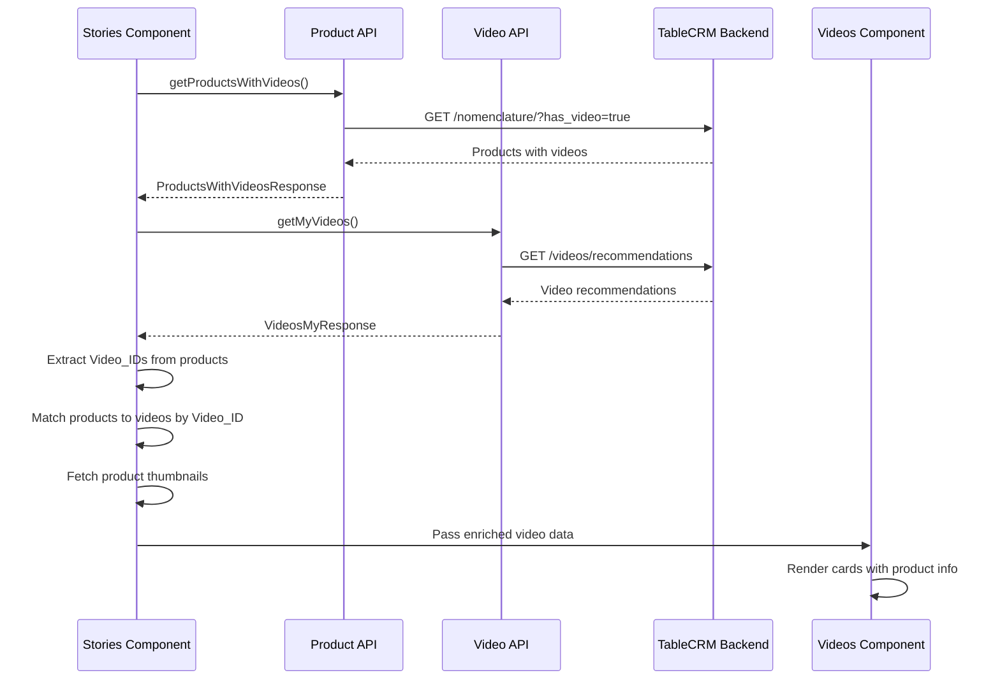

# Design Document: Product Video Stories Integration

## Overview

This design document specifies the technical implementation for integrating product data with video stories in the Stories component. The feature enables displaying product information (name and thumbnail) on video cards by fetching products with associated videos, extracting video identifiers from product URLs, and matching them with existing video data.

### Goals

- Fetch products that have associated videos from the TableCRM nomenclature API
- Extract video identifiers from product video URLs and match them with video data
- Display product names and thumbnails on video cards in the Stories section
- Maintain backward compatibility with the Reviews section
- Preserve existing video display logic when product data is unavailable

### Non-Goals

- Modifying the Reviews section behavior or data fetching logic
- Creating new video upload or management features
- Implementing product filtering or search functionality
- Adding product purchase flows directly from video cards

## Architecture

### Component Hierarchy

```
Stories (Widget)
  ├─ Fetches products with videos via Product API
  ├─ Fetches video recommendations via Video API
  ├─ Matches products to videos by Video_ID
  └─ Videos (Widget)
      └─ Renders video cards with product data or fallback to video metadata

Reviews (Widget)
  ├─ Fetches video recommendations via Video API
  └─ Videos (Widget)
      └─ Renders video cards with video metadata (unchanged)
```

### Data Flow



### Integration Points

1. **Product API Layer** (`src/entities/mp-product/api/api.ts`)
   - New function: `getProductsWithVideos()`
   - Uses existing `tableCrmApi` client
   - Follows existing error handling patterns

2. **Type Definitions** (`src/entities/mp-product/types/types.ts`, `src/entities/video/types/types.ts`)
   - New query params type: `ProductsWithVideosQueryParams`
   - New response type: `ProductsWithVideosResponse`
   - Extended `StoryVideo` type with optional product fields

3. **Stories Component** (`src/widgets/stories/Stories.tsx`)
   - Fetches products with videos
   - Performs video ID extraction and matching
   - Fetches product thumbnails
   - Passes enriched data to Videos component

4. **Videos Component** (`src/widgets/videos/Videos.tsx`)
   - Conditionally renders product data or video metadata
   - Uses `isReviews` prop to determine rendering mode
   - Maintains backward compatibility

## Components and Interfaces

### API Layer

#### New Function: `getProductsWithVideos`

**Location:** `src/entities/mp-product/api/api.ts`

**Signature:**

```typescript
export const getProductsWithVideos = async (
  params?: ProductsWithVideosQueryParams,
): Promise<ProductsWithVideosResponse>
```

**Implementation Pattern:**

- Uses `tableCrmApi.get<ProductsWithVideosResponse>("/nomenclature/", { params })`
- Includes `has_video: true` parameter
- Follows same error handling as `getMpProducts`
- Returns structured response with `result`, `count`, `limit`, `offset`, and optional `error`

**Error Handling:**

```typescript
try {
  const response = await tableCrmApi.get<ProductsWithVideosResponse>(
    "/nomenclature/",
    {
      params: { ...params, has_video: true },
    },
  );
  return response.data;
} catch (error) {
  const message =
    error instanceof Error
      ? error.message
      : "Failed to load products with videos";
  return {
    result: [],
    count: 0,
    limit: params?.limit,
    offset: params?.offset,
    error: message,
  };
}
```

### Video ID Extraction Logic

**Location:** `src/widgets/stories/Stories.tsx`

**Algorithm:**

```typescript
const extractVideoId = (product: MpProduct): number | null => {
  // Check if product has videos array
  if (!product.videos || product.videos.length === 0) {
    return null;
  }

  // Get first video URL
  const videoUrl = product.videos[0]?.url;
  if (!videoUrl) {
    return null;
  }

  // Extract last sequence of digits from URL
  const match = videoUrl.match(/(\d+)(?!.*\d)/);
  if (!match) {
    return null;
  }

  const videoId = parseInt(match[1], 10);
  return videoId > 0 ? videoId : null;
};
```

**Rationale:**

- Uses regex to find the last sequence of digits in the URL
- Validates that the extracted ID is a positive integer
- Returns `null` for invalid or missing data to allow graceful fallback

### Product-Video Matching Logic

**Location:** `src/widgets/stories/Stories.tsx`

**Implementation:**

```typescript
const matchProductsToVideos = async (
  products: MpProduct[],
  videos: StoryVideo[],
): Promise<StoryVideo[]> => {
  // Create a map of video_id to product
  const productMap = new Map<number, MpProduct>();

  for (const product of products) {
    const videoId = extractVideoId(product);
    if (videoId !== null) {
      productMap.set(videoId, product);
    }
  }

  // Enrich videos with product data
  const enrichedVideos = await Promise.all(
    videos.map(async (video) => {
      const product = productMap.get(video.id);

      if (!product) {
        return video; // No matching product, return original
      }

      // Fetch product thumbnail
      const picture = await getPicturesById(product.id);

      return {
        ...video,
        productName: product.name,
        productPhoto: picture?.public_url || picture?.url || undefined,
      };
    }),
  );

  return enrichedVideos;
};
```

**Rationale:**

- Uses a Map for O(1) lookup performance
- Handles missing product data gracefully
- Fetches thumbnails asynchronously in parallel
- Preserves original video data when no product match exists

### Component Modifications

#### Stories Component Changes

**Location:** `src/widgets/stories/Stories.tsx`

**New State:**

```typescript
const [productsWithVideos, setProductsWithVideos] = useState<MpProduct[]>([]);
const [isLoadingProducts, setIsLoadingProducts] = useState(true);
```

**New Effect:**

```typescript
useEffect(() => {
  const fetchProducts = async () => {
    setIsLoadingProducts(true);
    const response = await getProductsWithVideos({ limit: 50 });
    setProductsWithVideos(response.result);
    setIsLoadingProducts(false);
  };

  fetchProducts();
}, []);
```

**Modified Video Processing:**

```typescript
const videos = useMemo<StoryVideo[]>(async () => {
  const raw = data?.items ?? [];
  const baseVideos = raw.reduce<StoryVideo[]>((acc, item) => {
    // ... existing video mapping logic
  }, []);

  // Enrich with product data if available
  if (productsWithVideos.length > 0) {
    return await matchProductsToVideos(productsWithVideos, baseVideos);
  }

  return baseVideos;
}, [data, productsWithVideos]);
```

#### Videos Component Changes

**Location:** `src/widgets/videos/Videos.tsx`

**Modified Video Card Rendering:**

The video card title section will be conditionally rendered based on whether product data is available and whether this is the Reviews section:

```typescript
// Inside the video card button element
{(isTouchDevice || hoveredVideoId === video.id) && (
  <motion.div
    // ... existing animation props
    className="absolute inset-x-0 bottom-10 z-[3] flex max-w-full items-center justify-center px-1"
  >
    <div className="flex w-[80%] max-w-full min-w-0 items-center justify-center">
      <div className="min-w-0 flex-1 flex items-center h-12 rounded-lg bg-black px-4 py-1 text-white gap-2">
        {/* Show product thumbnail if available and not in Reviews mode */}
        {!isReviews && video.productPhoto && (
          <Image
            src={video.productPhoto}
            alt="Product"
            width={32}
            height={32}
            className="w-8 h-8 rounded object-cover shrink-0"
          />
        )}
        {/* Show product name or video title */}
        <p className="text-md leading-tight">
          {!isReviews && video.productName ? video.productName : video.title}
        </p>
      </div>
      <div className="flex h-12 w-12 shrink-0 items-center justify-center rounded-lg bg-black text-white">
        {/* ... existing arrow SVG */}
      </div>
    </div>
  </motion.div>
)}
```

**Rationale:**

- Uses `isReviews` prop to determine rendering mode
- Falls back to video title when product data is unavailable
- Maintains existing layout and styling
- Adds product thumbnail only in Stories mode

## Data Models

### New Types

**Location:** `src/entities/mp-product/types/types.ts`

```typescript
export interface ProductsWithVideosQueryParams {
  limit?: number;
  offset?: number;
  has_video?: boolean;
}

export interface ProductsWithVideosResponse {
  result: MpProduct[];
  count?: number;
  limit?: number;
  offset?: number;
  error?: string;
}
```

**Rationale:**

- Follows existing pattern from `MpProductsQueryParams` and `MpProductsResponse`
- Includes `has_video` parameter for API filtering
- Maintains consistent error handling structure

### Extended Types

**Location:** `src/entities/video/types/types.ts`

```typescript
export type StoryVideo = {
  avatar: string;
  id: number;
  title: string;
  src: string;
  poster?: string;
  user?: string;
  // New optional fields for product integration
  productName?: string;
  productPhoto?: string;
};
```

**Rationale:**

- Optional fields maintain backward compatibility
- Existing code continues to work without modification
- Product data is additive, not replacing existing fields

### Existing Types (Reference)

**MpProduct Video Structure:**

```typescript
videos: [
  {
    id: number;
    nomenclature_id: number;
    url: string;  // Contains video identifier
    description: string;
    tags: [];
    created_at: string;
    updated_at: string;
  }
]
```

**Pictures Type:**

```typescript
export interface Pictures {
  id: number;
  entity: string;
  entity_id: number;
  is_main: boolean;
  url: string;
  public_url: string;
  size: number;
  updated_at: number;
  created_at: number;
}
```

## Error Handling

### API Error Handling

**Product API Errors:**

- Network failures return empty result array with error message
- Invalid responses are caught and logged
- Component continues to function with video-only data

**Picture Fetching Errors:**

- Failed thumbnail fetches return `null`
- Video cards display without product photo
- Product name still displays if available

### Data Validation

**Video ID Extraction:**

```typescript
// Validates extracted ID
const videoId = parseInt(match[1], 10);
return videoId > 0 ? videoId : null;
```

**Product Matching:**

```typescript
// Gracefully handles missing matches
const product = productMap.get(video.id);
if (!product) {
  return video; // Return original video data
}
```

### Fallback Behavior

1. **No Products Available:** Videos display with original titles and metadata
2. **No Video ID Match:** Video displays with original title
3. **No Product Thumbnail:** Video displays product name without thumbnail
4. **API Failure:** Component displays videos with existing data, logs error

## Testing Strategy

### Unit Tests

**API Layer Tests:**

- Test `getProductsWithVideos` with successful response
- Test `getProductsWithVideos` with network error
- Test `getProductsWithVideos` with empty response
- Verify correct parameters are passed to TableCRM API

**Video ID Extraction Tests:**

- Test extraction from valid URL with trailing digits
- Test extraction from URL with multiple digit sequences
- Test handling of empty videos array
- Test handling of missing URL field
- Test handling of non-numeric URLs
- Test validation of positive integers

**Product Matching Tests:**

- Test matching with complete product and video data
- Test handling of videos without matching products
- Test handling of products without valid video IDs
- Test thumbnail fetching success and failure cases
- Test Map-based lookup performance

**Component Tests:**

- Test Stories component with product data
- Test Stories component without product data
- Test Videos component in Stories mode (isReviews=false)
- Test Videos component in Reviews mode (isReviews=true)
- Test conditional rendering of product name vs video title
- Test conditional rendering of product thumbnail

### Integration Tests

**End-to-End Flow:**

- Test complete flow from product fetch to video card display
- Test Stories section displays product information
- Test Reviews section displays video metadata unchanged
- Test error recovery when product API fails
- Test graceful degradation when thumbnails fail to load

### Manual Testing Checklist

- [ ] Stories section displays product names on video cards
- [ ] Stories section displays product thumbnails on video cards
- [ ] Reviews section displays video titles (unchanged behavior)
- [ ] Reviews section displays user avatars and stars (unchanged behavior)
- [ ] Video cards without matching products display video titles
- [ ] Modal view displays correctly with product data
- [ ] Touch device interactions work correctly
- [ ] Desktop pagination works correctly
- [ ] Error states display gracefully
- [ ] Loading states display correctly

## Implementation Notes

### Performance Considerations

**Parallel Data Fetching:**

```typescript
// Fetch products and videos in parallel
const [productsResponse, videosResponse] = await Promise.all([
  getProductsWithVideos({ limit: 50 }),
  getMyVideos({ limit: 15 }),
]);
```

**Thumbnail Fetching:**

```typescript
// Fetch all thumbnails in parallel
const enrichedVideos = await Promise.all(
  videos.map(async (video) => {
    // ... matching and enrichment logic
  }),
);
```

**Rationale:**

- Minimizes sequential API calls
- Reduces total loading time
- Improves perceived performance

### Caching Strategy

**Current Implementation:**

- React Query (via hooks) handles video data caching
- Product data fetched once per Stories component mount
- Thumbnails fetched once per product-video match

**Future Optimization:**

- Consider adding React Query for product data
- Implement thumbnail URL caching
- Add stale-while-revalidate strategy

### Backward Compatibility

**Reviews Section:**

- No changes to data fetching logic
- `isReviews` prop explicitly set to `true`
- Videos component checks `isReviews` before using product data
- Existing video metadata display logic preserved

**Videos Component:**

- New props are optional
- Existing usage patterns continue to work
- Conditional rendering based on data availability

### Migration Path

**Phase 1: API and Types**

1. Add new types to `src/entities/mp-product/types/types.ts`
2. Extend `StoryVideo` type in `src/entities/video/types/types.ts`
3. Implement `getProductsWithVideos` in `src/entities/mp-product/api/api.ts`

**Phase 2: Stories Component**

1. Add product fetching logic to Stories component
2. Implement video ID extraction function
3. Implement product-video matching function
4. Update video data processing to include product enrichment

**Phase 3: Videos Component**

1. Update video card rendering to conditionally show product data
2. Add product thumbnail rendering
3. Ensure `isReviews` prop controls rendering mode

**Phase 4: Testing and Validation**

1. Verify Stories section displays product information
2. Verify Reviews section behavior unchanged
3. Test error handling and fallback scenarios
4. Validate performance and loading states

## Dependencies

### External Dependencies

- **axios**: HTTP client (already in use via `tableCrmApi`)
- **react**: Component framework (already in use)
- **next/image**: Image optimization (already in use)
- **framer-motion**: Animations (already in use)

### Internal Dependencies

- `src/shared/api/clients.ts`: TableCRM API client
- `src/entities/mp-product/api/api.ts`: Product API functions
- `src/entities/video/api/api.ts`: Video API functions
- `src/entities/mp-product/types/types.ts`: Product type definitions
- `src/entities/video/types/types.ts`: Video type definitions

### API Dependencies

- **TableCRM Nomenclature API**: `/nomenclature/` endpoint with `has_video` parameter
- **TableCRM Pictures API**: `/pictures/` endpoint (existing)
- **Video Recommendations API**: `/videos/recommendations` endpoint (existing)

## Security Considerations

### Data Validation

- Validate video IDs are positive integers
- Sanitize product names before rendering
- Validate image URLs before passing to Next.js Image component

### API Security

- Use existing TableCRM token authentication
- No new authentication mechanisms required
- Follow existing API error handling patterns

### XSS Prevention

- Product names rendered through React (automatic escaping)
- Image URLs validated by Next.js Image component
- No direct HTML injection

## Deployment Considerations

### Environment Variables

No new environment variables required. Uses existing:

- `NEXT_PUBLIC_TABLECRM_API_URL`
- `NEXT_PUBLIC_TABLE_CRM_TOKEN`

### Build Process

- No changes to build configuration
- TypeScript compilation validates new types
- Next.js optimizes images automatically

### Rollback Plan

If issues arise:

1. Revert Stories component changes
2. Videos component remains backward compatible
3. Reviews section unaffected
4. Remove new API function (unused code)

### Monitoring

**Key Metrics:**

- Product API response time
- Product-video match rate
- Thumbnail load success rate
- Stories section render time

**Error Tracking:**

- Log product API failures
- Log video ID extraction failures
- Log thumbnail fetch failures
- Monitor fallback usage rate

## Future Enhancements

### Potential Improvements

1. **Product Click-Through:**
   - Add click handler to navigate to product page
   - Track video-to-product conversion rate

2. **Caching Optimization:**
   - Implement React Query for product data
   - Cache thumbnail URLs in localStorage
   - Add service worker for offline support

3. **Performance Optimization:**
   - Lazy load product data on scroll
   - Implement virtual scrolling for large video lists
   - Preload thumbnails for visible videos

4. **Enhanced Matching:**
   - Support multiple videos per product
   - Implement fuzzy matching for video IDs
   - Add manual product-video associations

5. **Analytics:**
   - Track which products are viewed via videos
   - Measure engagement with product-enriched cards
   - A/B test product display variations

### Out of Scope

- Product purchase flow from video cards
- Video upload or management features
- Product filtering or search in Stories
- Real-time video updates
- User-generated product associations
